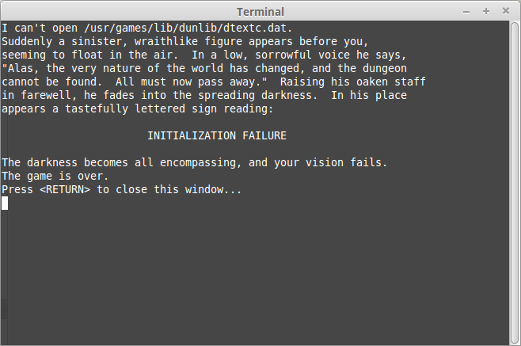

# Zork

[](https://travis-ci.org/richelbilderbeek/Zork)

Zork made compilable by Qt Creator.


## Building

From the command-line:

```
./build.sh
```

Note: upon running `./Zork`, this will give a segmentation fault after most commands, see `Segmentation fault`

From Qt Creator:

 * Start Qt Creator
 * Open `Zork.pro`
 * Press Run (it will run, but not work, see `It runs but it does not work!`)

## It runs but it does not work!

It does not work because of the following error:

```
I can't open /usr/games/lib/dunlib/dtextc.dat.
```



Solution: 

Copy the file `dtextc.dat` to the same folder as the executable

## Errors

### `Cannot find -lcurses`

```
sudo apt-get install libncurses-dev
```

### `Cannot find -ltermcap`

```
sudo apt-get install libncurses-dev
```

### Segmentation fault

When you have built Zork using `build.sh` and started the game with `./Zork` most commands terminate the program with a segmentation fault.

I have no idea why. If you do, please let me know.
